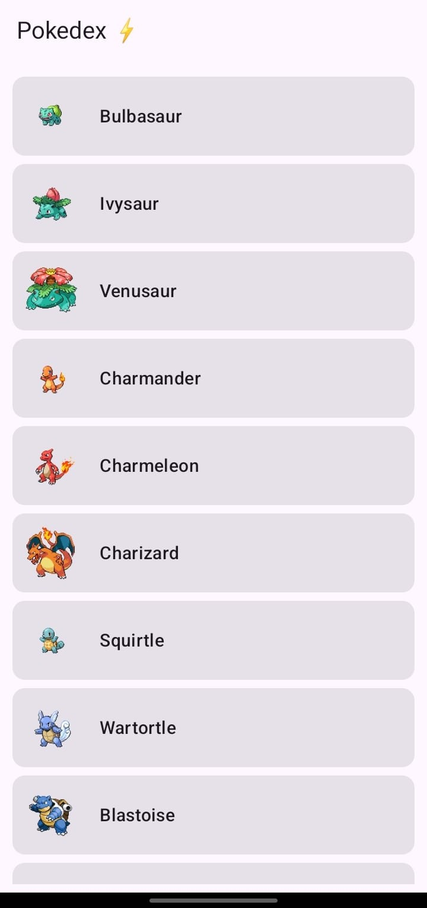
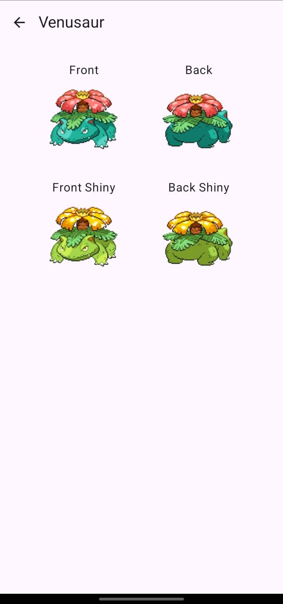

# Pokedex App - Laboratorio #5
Aplicación desarrollada en **Kotlin** utilizando **Jetpack Compose**, **Retrofit** y **Navigation**.  
El objetivo del laboratorio fue poner en práctica los permisos y el acceso a internet, así como reforzar conceptos previos como el diseño de UI y navegación.

## 🗒️ Descripción

La aplicación consume el API pública de [PokeAPI](https://pokeapi.co/) y permite:

1. **Pantalla de Listado de Pokémon**  
   - Se muestran los primeros 100 Pokémon obtenidos desde el endpoint de la PokeAPI.  
   - Junto al nombre de cada Pokémon se presenta su sprite frontal en miniatura.  
   - Al hacer clic sobre un Pokémon, se navega hacia la pantalla de detalle.

2. **Pantalla de Detalle de Pokémon**  
   - Se muestran cuatro imágenes del Pokémon seleccionado:
     - Vista frontal normal.
     - Vista trasera normal.
     - Vista frontal shiny.
     - Vista trasera shiny.  
   - Cada imagen está acompañada por su respectiva etiqueta descriptiva.  
   - Incluye una barra superior con botón de retroceso para regresar al listado.

## 📸 Capturas de Pantalla

### Pantalla de Listado

### Pantalla de Detalle

